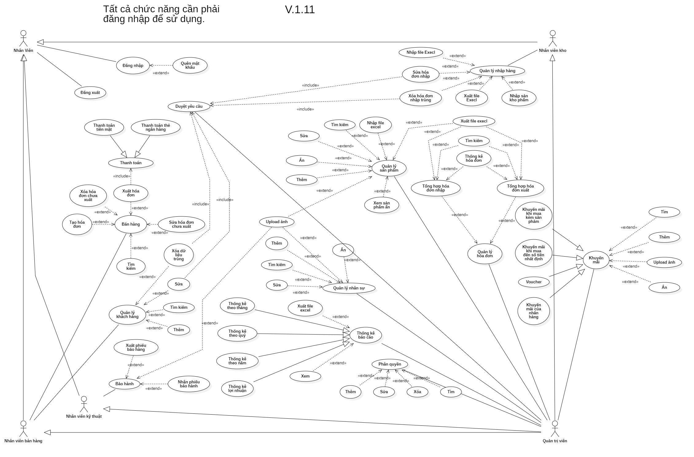

# Tài Liệu Phần Mềm Quản Lý Cửa Hàng Đồ Công Nghệ

## I. Chức năng:

### &ensp; 1. Bán hàng:
  - Thêm hoặc xóa sản phẩm bán trong danh sách bán.
  - Thêm hóa đơn mới (Lập hóa đơn).
  - Xóa hóa đơn chưa thanh toán.
  - Có thể chỉnh số lượng sản phẩm bán có trong danh sách bán.
  - Cho phép lưu họ tên và số điện thoại khách hàng và ghi chú thêm nếu có.
  - Sau khi có đầy đủ thông tin thì xuất hóa đơn bán.

### &ensp; 2. Quản lý sản phẩm:
  - Có thể thêm, xóa, sửa thông tin sản phẩm.
  - Import và Export được file excel.

### &ensp; 3. Quản lý khách hàng:
  - Có thể thêm, xóa, sửa thông tin khách hàng.
  - Cho phép đánh giá mức độ với các ngôi sao (tối đa 8 sao) các tiêu chí sau:
    - Mức độ tiếp cận khách hàng.
    - Khách hàng chủ động.
    - Trao đổi khách hàng.
    - Chốt deal nhanh chống.
    - Khách hàng yêu cầu.

### &ensp; 4. Quản lý nhập hàng:
  - Có 2 trường hợp
  - Trường hợp 1: nhập mới hoàn toàn sản phẩm, tức là sản phẩm chưa từng kinh doanh trong hệ thống.
  - Trường hợp 2: nhập sản phẩm đã từng kinh doanh trong hệ thống, lúc này chỉ cần nhập mã IMEI của sản phẩm.

### &ensp; 5. Quản lý hóa đơn:
  - Thống kê tất cả hóa đơn nhập và bán.
  - Cho phép thống kê hóa đơn theo ngày, tháng (tối đa 3 tháng).
  - Cho phép thống kê hóa theo ngày bắt đầu và kết thúc (tối đa 3 tháng).
  - Cho phép tìm kiếm hóa đơn theo ngày, mã nhân viên, tên nhân viên, mã khách hàng, tên khách hàng.

### &ensp; 6. Quản lý khuyến mãi:
  - Tạo mới một chương trình khuyến mãi và phải xác nhận trước khi tạo nếu tạo sai bắt buọc xóa làm lại, tạo một khuyến mãi gồm các thông tin loại hình khuyến mãi, giá trị hoặc phần trăm giá trị hoặc loại sản phẩm tặng kèm, phải có thời gian bắt đầu và kết thúc, có mô tả chi tiết và hướng dẩn của khuyến mãi, có thể có các hình ảnh liên quan.

### &ensp; 7. Thống kê báo cáo:
  - Báo cáo doanh thu theo ngày, tháng, quý.
  - Báo cáo bán hàng theo nhân viên: giúp đánh giá hiệu quả làm việc của từng nhân viên dựa theo doanh số bán hàng của nhân viên.
  - Báo cáo bán hàng theo khách hàng: có thể xem khách hàng nào có doanh số mua hàng nhiều nhất để đưa ra các chính sách ưu dãi cho khách hàng than thiết hoặc chăm sóc khách hàng phù hợp.
  - Báo các hàng tồn kho.
  - Báo cáo hàng bán chạy(hiệu suất sản phẩm), nhóm sản phẩm bán chạy.

### &ensp; 8. Phân quyền:
  - Dựa theo chức vụ của nhân viên từ đó cho phép nhân viên có quyền sử dụng những chức năng nào trong hệ thống.

### &ensp; 9. Quản lý nhân sự:
  - Thêm, xóa, sửa thông tin nhân sự.
  - Trạng thái nhân sự nghĩ việc, nghĩ phép,…
### &ensp; 10. Bảo hành:
  - Bảo hành gồm nhóm các chức năng nhập, xuất phiếu bảo hành, các thông tin cần cho việc bảo hành bao gồm tem bảo hành, số điện thoại hoặc hóa đơn bán hàng, hình ảnh sản phẩm trước khi nhận bảo hành. Sau khi có đủ các thông tin nhân viên xuất phiếu bảo hành và dán tem bảo hành vào sản phẩm cho khách hàng, khi nhận phiếu bảo hành từ khách hàng lấy hàng và cho khách hàng kiểm tra sản phẩm bảo hàng sao đó lý xác nhận và nhận hàng.

## II. Tổng quan chức năng:

### &ensp; Link ảnh [Use case tổng quan chức năng](images/UseCaseWebSale.png).

## III. Phân tích chức năng:

### &emsp; [1. Chức năng bán hàng](features/sale/sale.md).
### &emsp; [2. Chức năng quản lý sản phẩm](features/product-management/product-management.md).
### &emsp; [3. Chức năng quản lý khách hàng](features/customer-management/customer-management.md).
### &emsp; [4. Chức năng quản lý nhập hàng](features/import-manager/import-manager.md).
### &emsp; [5. Chức năng quản lý hóa đơn](features/bill-management/bill-management.md).
### &emsp; [6. Chức năng quản lý khuyến mãi](features/promotion-manager/promotion-manager.md).
### &emsp; [7. Chức năng quản lý thống kê báo cáo](features/statistical-reporting/statistical-reporting.md).
### &emsp; [8. Chức năng quản lý phân quyền](features/role/role.md).
### &emsp; [9. Chức năng quản lý nhân sự](features/employee-manager/employee-manager.md).
### &emsp; [10. Chức năng bảo hành](features/warranty/warranty.md).

## IV. Công Nghệ Liên Quan:
  1. Công cụ: IDE Visual Studio 2022, Git, Github.
  2. Cơ sở dữ liệu: SQL Server 2019
  3. Ngôn ngữ: C#.
  4. Framework: WPF, Entityframework Core, .Net Core.

## V. Kiến trúc code: 
  - Mô hình: MVVM(Model-View-ViewModel)