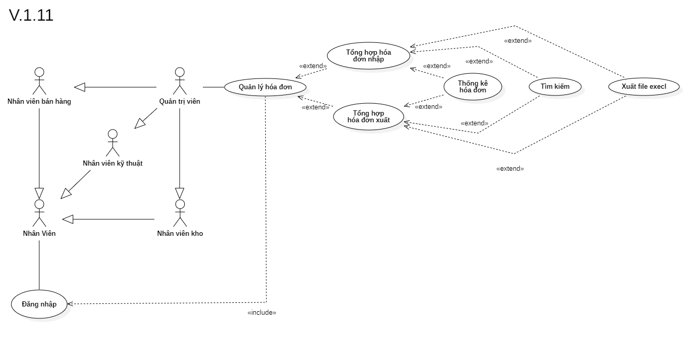

# Phân tích chức năng quản lý hóa đơn

## I. Phân tích use case:

#### Link ảnh [Use case quản lý hóa đơn](images/UseCaseBillManagement.png).

### Đặc tả chức năng quản lý hóa đơn:

<table>
  <tbody>
    <tr>
      <td>
        <b>Tên chức năng</b>
      </td>
      <td>Quản lý hóa đơn</td>
    </tr>
    <tr>
      <td>
        <b>Tác nhân</b>
      </td>
      <td>Quản trị viên</td>
    </tr>
    <tr>
      <td>
        <b>Điều kiện trước</b>
      </td>
      <td>Đăng nhập vào hệ thống</td>
    </tr>
    <tr>
      <td>
        <b>Điều kiện sau</b>
      </td>
      <td>
       Khi nhấn nút thoát chức năng.
      </td>
    </tr>
    <tr>
      <td>
        <b>Luồng sự kiện</b>
      </td>
      <td>
        <table>
          <tbody>
            <b>Thống kê hóa đơn nhập hoặc xuất.</b>
            <tr>
              <td>STT</td>
              <td>Tác nhân</td>
              <td>Hệ thống phản hồi</td>
            </tr>
            <tr>
              <td>1</td>
              <td>Truy cập vào hệ thống chọn chức năng quản lý hóa đơn.</td>
              <td>
                Trả về giao diện chức quản lý hóa đơn.
              </td>
            </tr>
            <tr>
              <td>2</td>
              <td>Nhấn vào nút thống kê hóa đơn.</td>
              <td>
                Trả về cửa sổ điền các thông tin cần thống kê hóa đơn, bao gồm loại hóa đơn, khoảng thời gian.
              </td>
            </tr>
            <tr>
              <td>3</td>
              <td>Người dùng nhấn nút xem thống kê.</td>
              <td>
                Hệ thống trả ra giao diện thống kê theo các thông tin đã điền.
              </td>
            </tr>
          </tbody>
        </table>
      </td>
    </tr>
    <tr>
      <td>
        <b>Luồng thay thế</b>
      </td>
      <td>
        <table>
          <tbody>
            <b>1. Tìm kiếm thông tin hóa đơn.</b>
            <tr>
              <td>STT</td>
              <td>Tác nhân</td>
              <td>Hệ thống phản hồi</td>
            </tr>
            <tr>
              <td>1</td>
              <td>Truy cập vào hệ thống và vào chức năng quản lý hóa đơn.</td>
              <td>
                Trả về giao diện chức năng quản lý hóa đơn.
              </td>
            </tr>
            <tr>
              <td>2</td>
              <td>Nhập mã hóa đơn cần tìm thông tin.</td>
              <td>
                Trả về danh sách hóa đơn có thông tin trùng khớp.
              </td>
            </tr>
          </tbody>
        </table>
        <table>
          <tbody>
            <b>2. Thống kê hóa đơn nhập hoặc xuất ra file excel.</b>
            <tr>
              <td>STT</td>
              <td>Tác nhân</td>
              <td>Hệ thống phản hồi</td>
            </tr>
            <tr>
              <td>1</td>
              <td>Truy cập vào hệ thống chọn chức năng quản lý hóa đơn.</td>
              <td>
                Trả về giao diện chức quản lý hóa đơn.
              </td>
            </tr>
            <tr>
              <td>2</td>
              <td>Nhấn vào nút thống kê hóa đơn.</td>
              <td>
                Trả về cửa sổ điền các thông tin cần thống kê hóa đơn, bao gồm loại hóa đơn, khoảng thời gian.
              </td>
            </tr>
            <tr>
              <td>3</td>
              <td>Người dùng nhấn nút xem thống kê.</td>
              <td>
                Hệ thống trả ra giao diện thống kê theo các thông tin đã điền.
              </td>
            </tr>
            <tr>
              <td>4</td>
              <td>Người dùng nhấn nút xuất ra file excel.</td>
              <td>
                Hệ thống lấy dữ liệu và tạo file excel cho khách hàng.
              </td>
            </tr>
          </tbody>
        </table>
      </td>
    </tr>
        <tr>
      <td>
        <b>Luồng ngoại lệ</b>
      </td>
      <td>
        <table>
          <tbody>
            <b>Thoát chức năng.</b>
            <tr>
              <td>STT</td>
              <td>Tác nhân</td>
              <td>Hệ thống phản hồi</td>
            </tr>
            <tr>
              <td>1</td>
              <td>Đang ở giao diện chức năng quản lý hóa đơn.</td>
              <td>
                Hệ thông đang lưu các dữ liệu tạm thời để chạy chức năng quản lý hóa đơn.
              </td>
            </tr>
            <tr>
              <td>2</td>
              <td>Nhấn nút thoát.</td>
              <td>
                Hệ thống trả lại giao diện chính và xóa các dữ liệu lưu tạm thời của chức năng quản lý hóa đơn.
              </td>
            </tr>
          </tbody>
        </table>
      </td>
    </tr>
    <tr>
      <td>
        <b>Mô tả</b>
      </td>
      <td>
        Cho phép người dùng thống kê thông tin của hóa đơn nhập hoặc xuất cũng như tìm kiếm và xuất ra file excel cho khách hàng.
      </td>
    </tr>
  </tbody>
</table>

## II. Phân tích sequence diagram: