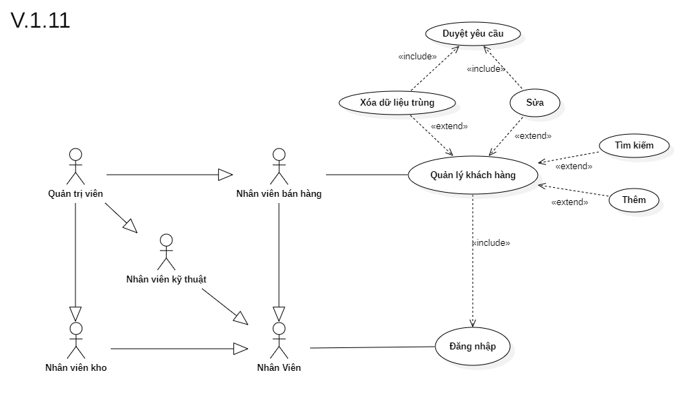

# Phân tích chức năng quản lý khách hàng

## I. Phân tích use case:
  

#### Link ảnh [Use case quản lý khách hàng](images/UseCaseCustomerManagement.png).

### Đặc tả chức năng quản lý khách hàng:

<table>
  <tbody>
    <tr>
      <td>
        <b>Tên chức năng</b>
      </td>
      <td>Quản lý khách hàng</td>
    </tr>
    <tr>
      <td>
        <b>Tác nhân</b>
      </td>
      <td>Nhân viên bán hàng</td>
    </tr>
    <tr>
      <td>
        <b>Điều kiện trước</b>
      </td>
      <td>Đăng nhập vào hệ thống</td>
    </tr>
    <tr>
      <td>
        <b>Điều kiện sau</b>
      </td>
      <td>
       Khi nhấn nút thoát chức năng.
      </td>
    </tr>
    <tr>
      <td>
        <b>Luồng sự kiện</b>
      </td>
      <td>
        <table>
          <tbody>
            <b>Tạo khách hàng mới vào hệ thống.</b>
            <tr>
              <td>STT</td>
              <td>Tác nhân</td>
              <td>Hệ thống phản hồi</td>
            </tr>
            <tr>
              <td>1</td>
              <td>Truy cập vào hệ thống chọn chức năng quản lý khách hàng.</td>
              <td>
                Trả về giao diện chức quản lý khách hàng.
              </td>
            </tr>
            <tr>
              <td>2</td>
              <td>Nhấn vào nút thêm mới khách hàng.</td>
              <td>
                Trả về một giao diện form điền các thông tin về khách hàng mới vào hệ thống.
              </td>
            </tr>
            <tr>
              <td>3</td>
              <td>Nhấn nút lưu lại thông tin khách hàng mới.</td>
              <td>
                Hệ thông lưu lại thông tin về khách hàng mới vào hệ thống.
              </td>
            </tr>
          </tbody>
        </table>
      </td>
    </tr>
    <tr>
      <td>
        <b>Luồng thay thế</b>
      </td>
      <td>
        <table>
          <tbody>
            <b>1. Tìm kiếm thông tin khách hàng.</b>
            <tr>
              <td>STT</td>
              <td>Tác nhân</td>
              <td>Hệ thống phản hồi</td>
            </tr>
            <tr>
              <td>1</td>
              <td>Truy cập vào hệ thống và vào chức năng quản lý khách hàng.</td>
              <td>
                Trả về giao diện chức năng quản lý khách hàng.
              </td>
            </tr>
            <tr>
              <td>2</td>
              <td>Nhập tên hoặc số điện thoại khách hàng cần tìm thông tin.</td>
              <td>
                Trả về danh sách khách hàng có thông tin trùng khớp.
              </td>
            </tr>
          </tbody>
        </table>
        <table>
          <tbody>
            <b>2. Cập nhật thông tin khách hàng (Nhân viên bán hàng).</b>
            <tr>
              <td>STT</td>
              <td>Tác nhân</td>
              <td>Hệ thống phản hồi</td>
            </tr>
            <tr>
              <td>1</td>
              <td>Truy cập vào hệ thống và vào chức năng quản lý khách hàng.</td>
              <td>
                Trả về giao diện chức năng quản lý khách hàng.
              </td>
            </tr>
            <tr>
              <td>2</td>
              <td>Nhập tên hoặc số điện thoại khách hàng cần chỉnh sửa thông tin.</td>
              <td>
                Trả về danh sách khách hàng có thông tin trùng khớp.
              </td>
            </tr>
            <tr>
              <td>3</td>
              <td>Chọn khách hàng cần cập nhật thông tin cần chỉnh sửa.</td>
              <td>
                Trả về thông tin khách hàng cần chỉnh sửa.
              </td>
            </tr>
            <tr>
              <td>4</td>
              <td>Nhập thông tin cần thay đổi của khách hàng.</td>
              <td>
                Kiểm tra tính đúng đắn của thông tin nhập vào.
              </td>
            </tr>
            <tr>
              <td>5</td>
              <td>Nhấn nút lưu.</td>
              <td>
                Hệ thống thông báo chờ quản trị viên duyệt để thay đổi thông tin khách hàng.
              </td>
            </tr>
          </tbody>
        </table>
        <table>
          <tbody>
            <b>3. Cập nhật thông tin khách hàng (Quản trị viên).</b>
            <tr>
              <td>STT</td>
              <td>Tác nhân</td>
              <td>Hệ thống phản hồi</td>
            </tr>
            <tr>
              <td>1</td>
              <td>Truy cập vào hệ thống và vào chức năng quản lý khách hàng.</td>
              <td>
                Trả về giao diện chức năng quản lý khách hàng.
              </td>
            </tr>
            <tr>
              <td>2</td>
              <td>Nhập tên hoặc số điện thoại khách hàng cần chỉnh sửa thông tin.</td>
              <td>
                Trả về danh sách khách hàng có thông tin trùng khớp.
              </td>
            </tr>
            <tr>
              <td>3</td>
              <td>Chọn khách hàng cần cập nhật thông tin cần chỉnh sửa.</td>
              <td>
                Trả về thông tin khách hàng cần chỉnh sửa.
              </td>
            </tr>
            <tr>
              <td>4</td>
              <td>Nhập thông tin cần thay đổi của khách hàng.</td>
              <td>
                Kiểm tra tính đúng đắn của thông tin nhập vào.
              </td>
            </tr>
            <tr>
              <td>5</td>
              <td>Nhấn nút lưu.</td>
              <td>
                Hệ thống lưu lại thông tin mới cập nhật của khách hàng.
              </td>
            </tr>
          </tbody>
        </table>
        <table>
          <tbody>
            <b>4. Xóa dữ liệu khách hàng trùng nếu là tài khoản nhân viên bán hàng.</b>
            <tr>
              <td>STT</td>
              <td>Tác nhân</td>
              <td>Hệ thống phản hồi</td>
            </tr>
            <tr>
              <td>1</td>
              <td>Truy cập vào hệ thống và vào chức năng quản lý khách hàng.</td>
              <td>
                Trả về giao diện chức năng quản lý khách hàng.
              </td>
            </tr>
            <tr>
              <td>2</td>
              <td>Nhập tên hoặc số điện thoại khách hàng cần chỉnh sửa thông tin.</td>
              <td>
                Trả về danh sách khách hàng có thông tin trùng khớp.
              </td>
            </tr>
            <tr>
              <td>3</td>
              <td>Chọn dữ liệu khách hàng trùng cần xóa.</td>
              <td>
                Trả về thông tin khách hàng cần xóa.
              </td>
            </tr>
            <tr>
              <td>4</td>
              <td>Nhấn nút xóa.</td>
              <td>
                Hệ thống thông báo chờ quản lý duyệt để xóa.
              </td>
            </tr>
          </tbody>
        </table>
        <table>
          <tbody>
            <b>5. Xóa dữ liệu khách hàng trùng nếu là tài khoản quản trị viên.</b>
            <tr>
              <td>STT</td>
              <td>Tác nhân</td>
              <td>Hệ thống phản hồi</td>
            </tr>
            <tr>
              <td>1</td>
              <td>Truy cập vào hệ thống và vào chức năng quản lý khách hàng.</td>
              <td>
                Trả về giao diện chức năng quản lý khách hàng.
              </td>
            </tr>
            <tr>
              <td>2</td>
              <td>Nhập tên hoặc số điện thoại khách hàng cần chỉnh sửa thông tin.</td>
              <td>
                Trả về danh sách khách hàng có thông tin trùng khớp.
              </td>
            </tr>
            <tr>
              <td>3</td>
              <td>Chọn dữ liệu khách hàng trùng cần xóa.</td>
              <td>
                Trả về thông tin khách hàng cần xóa.
              </td>
            </tr>
            <tr>
              <td>4</td>
              <td>Nhấn nút xóa.</td>
              <td>
                Hệ thống trả về cửa sổ xác nhận xóa dữ liệu khách hàng không.
              </td>
            </tr>
            <tr>
              <td>5</td>
              <td>Nhấn nút xác nhận.</td>
              <td>
                Hệ thống xóa dữ liệu khách hàng trong cơ sỡ dữ liệu.
              </td>
            </tr>
          </tbody>
        </table>
      </td>
    </tr>
        <tr>
      <td>
        <b>Luồng ngoại lệ</b>
      </td>
      <td>
        <table>
          <tbody>
            <b>Thoát chức năng.</b>
            <tr>
              <td>STT</td>
              <td>Tác nhân</td>
              <td>Hệ thống phản hồi</td>
            </tr>
            <tr>
              <td>1</td>
              <td>Đang ở giao diện chức năng quản lý khách hàng.</td>
              <td>
                Hệ thông đang lưu các dữ liệu tạm thời để chạy chức năng quản lý khách hàng.
              </td>
            </tr>
            <tr>
              <td>2</td>
              <td>Nhấn nút thoát.</td>
              <td>
                Hệ thống trả lại giao diện chính và xóa các dữ liệu lưu tạm thời của chức năng quản lý khách hàng.
              </td>
            </tr>
          </tbody>
        </table>
      </td>
    </tr>
    <tr>
      <td>
        <b>Mô tả</b>
      </td>
      <td>
        Cho phép thêm, xóa dữ liệu trùng, cập nhật thông tin của khách hàng bên trong hệ thống.
      </td>
    </tr>
  </tbody>
</table>