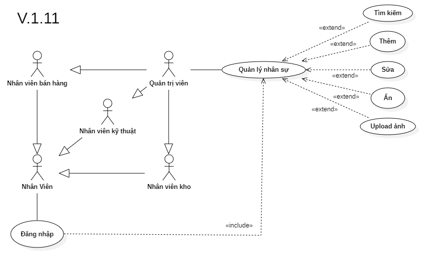

# Phân tích chức năng quản lý nhân sự

## I. Phân tích use case:
  

#### Link ảnh [Use case quản lý nhân sự](images/UseCaseEmployeeManager.png).

### Đặc tả chức năng quản lý nhân sự:

<table>
  <tbody>
    <tr>
      <td>
        <b>Tên chức năng</b>
      </td>
      <td>Quản lý nhân sự</td>
    </tr>
    <tr>
      <td>
        <b>Tác nhân</b>
      </td>
      <td>Quản trị viên</td>
    </tr>
    <tr>
      <td>
        <b>Điều kiện trước</b>
      </td>
      <td>Đăng nhập vào hệ thống</td>
    </tr>
    <tr>
      <td>
        <b>Điều kiện sau</b>
      </td>
      <td>
       Khi nhấn nút thoát chức năng.
      </td>
    </tr>
    <tr>
      <td>
        <b>Luồng sự kiện</b>
      </td>
      <td>
        <table>
          <tbody>
            <b>Tạo dữ liệu nhân sự mới.</b>
            <tr>
              <td>STT</td>
              <td>Tác nhân</td>
              <td>Hệ thống phản hồi</td>
            </tr>
            <tr>
              <td>1</td>
              <td>Truy cập vào hệ thống chọn chức năng quản lý nhân sự.</td>
              <td>
                Trả về giao diện chức quản lý nhân sự.
              </td>
            </tr>
            <tr>
              <td>2</td>
              <td>Nhấn vào nút tạo nhân sự.</td>
              <td>
                Trả về cửa sổ điền các thông tin cần để tạo nhân sự mới.
              </td>
            </tr>
            <tr>
              <td>3</td>
              <td>Người dùng nhấn nút lưu.</td>
              <td>
                Hệ thống lưu thông tin nhân sự mới vào hệ thống.
              </td>
            </tr>
          </tbody>
        </table>
      </td>
    </tr>
    <tr>
      <td>
        <b>Luồng thay thế</b>
      </td>
      <td>
        <table>
          <tbody>
            <b>1. Tìm kiếm thông tin nhân sự.</b>
            <tr>
              <td>STT</td>
              <td>Tác nhân</td>
              <td>Hệ thống phản hồi</td>
            </tr>
            <tr>
              <td>1</td>
              <td>Truy cập vào hệ thống và vào chức năng quản lý nhân sự.</td>
              <td>
                Trả về giao diện chức năng quản lý nhân sự.
              </td>
            </tr>
            <tr>
              <td>2</td>
              <td>Nhập mã nhân sự hoặc tên cần tìm thông tin.</td>
              <td>
                Trả về danh sách nhân sự có thông tin trùng khớp.
              </td>
            </tr>
          </tbody>
        </table>
        <table>
          <tbody>
            <b>2. Tìm kiếm thông tin nhân sự đã ẩn.</b>
            <tr>
              <td>STT</td>
              <td>Tác nhân</td>
              <td>Hệ thống phản hồi</td>
            </tr>
            <tr>
              <td>1</td>
              <td>Truy cập vào hệ thống và vào chức năng quản lý nhân sự.</td>
              <td>
                Trả về giao diện chức năng quản lý nhân sự.
              </td>
            </tr>
            <tr>
              <td>2</td>
              <td>Nhập mã nhân sự hoặc tên cần tìm thông tin và chon tìm nhân viên đã ẩn.</td>
              <td>
                Trả về danh sách nhân sự có thông tin trùng khớp.
              </td>
            </tr>
          </tbody>
        </table>
        <table>
          <tbody>
            <b>3 Cập nhật thông tin nhân sự.</b>
            <tr>
              <td>STT</td>
              <td>Tác nhân</td>
              <td>Hệ thống phản hồi</td>
            </tr>
            <tr>
              <td>1</td>
              <td>Truy cập vào hệ thống chọn chức năng quản lý nhân sự.</td>
              <td>
                Trả về giao diện chức quản lý nhân sự.
              </td>
            </tr>
            <tr>
              <td>2</td>
              <td>Nhập mã nhân sự hoặc tên cần tìm thông tin.</td>
              <td>
                Trả về danh sách nhân sự có thông tin trùng khớp.
              </td>
            </tr>
            <tr>
              <td>3</td>
              <td>Chọn nhân sự cần cập nhật thông tin.</td>
              <td>
                Hệ thống hiển thị thông tin chi tiết của nhân sự cần cập nhật.
              </td>
            </tr>
            <tr>
              <td>4</td>
              <td>Nhập thông tin cần thay đổi của nhân sự.</td>
              <td>
                Hệ thông kiểm tra tính đúng đắn của dữ liệu vừa nhập.
              </td>
            </tr>
            <tr>
              <td>5</td>
              <td>Người dùng nhấn nút lưu.</td>
              <td>
                Hệ thông lưu lại thông tin vừa được thay đổi của nhân sự.
              </td>
            </tr>
          </tbody>
        </table>
        <table>
          <tbody>
            <b>4. Ẩn thông tin nhân sự.</b>
            <tr>
              <td>STT</td>
              <td>Tác nhân</td>
              <td>Hệ thống phản hồi</td>
            </tr>
            <tr>
              <td>1</td>
              <td>Truy cập vào hệ thống chọn chức năng quản lý nhân sự.</td>
              <td>
                Trả về giao diện chức quản lý nhân sự.
              </td>
            </tr>
            <tr>
              <td>2</td>
              <td>Nhập mã nhân sự hoặc tên cần tìm thông tin.</td>
              <td>
                Trả về danh sách nhân sự có thông tin trùng khớp.
              </td>
            </tr>
            <tr>
              <td>3</td>
              <td>Chọn nhân sự cần ẩn thông tin.</td>
              <td>
                Hệ thống hiển thị thông tin chi tiết của nhân sự cần ẩn.
              </td>
            </tr>
            <tr>
              <td>4</td>
              <td>Nhấn nút ẩn nhân sự.</td>
              <td>
                Hệ thống ẩn thông tin nhân viên.
              </td>
            </tr>
          </tbody>
        </table>
      </td>
    </tr>
        <tr>
      <td>
        <b>Luồng ngoại lệ</b>
      </td>
      <td>
        <table>
          <tbody>
            <b>Thoát chức năng.</b>
            <tr>
              <td>STT</td>
              <td>Tác nhân</td>
              <td>Hệ thống phản hồi</td>
            </tr>
            <tr>
              <td>1</td>
              <td>Đang ở giao diện chức năng quản lý nhân sự.</td>
              <td>
                Hệ thông đang lưu các dữ liệu tạm thời để chạy chức năng quản lý nhân sự.
              </td>
            </tr>
            <tr>
              <td>2</td>
              <td>Nhấn nút thoát.</td>
              <td>
                Hệ thống trả lại giao diện chính và xóa các dữ liệu lưu tạm thời của chức năng quản lý nhân sự.
              </td>
            </tr>
          </tbody>
        </table>
      </td>
    </tr>
    <tr>
      <td>
        <b>Mô tả</b>
      </td>
      <td>
        Hổ trợ người dùng quản lý dữ liệu nhân viên, thêm mới, cập nhật hoặc ẩn nhân viên không còn làm việc nữa.
      </td>
    </tr>
  </tbody>
</table>