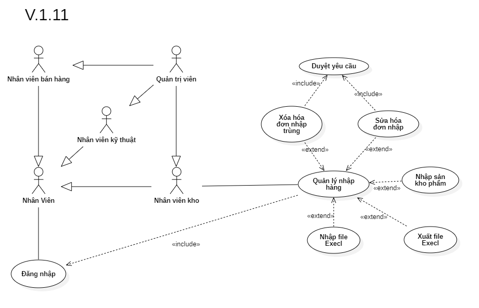

# Phân tích chức năng quản lý nhập hàng

## I. Phân tích use case:
  

#### Link ảnh [Use case quản lý nhập hàng](images/UseCaseImportManager.png).

### Đặc tả chức năng quản lý nhập hàng:

<table>
  <tbody>
    <tr>
      <td>
        <b>Tên chức năng</b>
      </td>
      <td>Quản lý nhập hàng</td>
    </tr>
    <tr>
      <td>
        <b>Tác nhân</b>
      </td>
      <td>Nhân viên kho</td>
    </tr>
    <tr>
      <td>
        <b>Điều kiện trước</b>
      </td>
      <td>Đăng nhập vào hệ thống</td>
    </tr>
    <tr>
      <td>
        <b>Điều kiện sau</b>
      </td>
      <td>
       Khi nhấn nút thoát chức năng.
      </td>
    </tr>
    <tr>
      <td>
        <b>Luồng sự kiện</b>
      </td>
      <td>
        <table>
          <tbody>
            <b>Nhập đơn hàng mới vào hệ thống.</b>
            <tr>
              <td>STT</td>
              <td>Tác nhân</td>
              <td>Hệ thống phản hồi</td>
            </tr>
            <tr>
              <td>1</td>
              <td>Truy cập vào hệ thống chọn chức năng quản lý nhập hàng.</td>
              <td>
                Trả về giao diện chức quản lý nhập hàng.
              </td>
            </tr>
            <tr>
              <td>2</td>
              <td>Nhấn vào nút thêm mới nhập hàng.</td>
              <td>
                Trả về một giao diện form điền các thông tin về nhập hàng mới vào hệ thống.
              </td>
            </tr>
            <tr>
              <td>3</td>
              <td>Nhấn thông tin nhập đơn hàng mới.</td>
              <td>
                Hệ thông kiểm tra tính đúng đắn của dữ liệu và kiểm tra sản phậm mới nhập vào có tồn tại trong hệ thống.
              </td>
            </tr>
            <tr>
              <td>4</td>
              <td>Nhấn nút lưu lại thông tin nhập đơn hàng mới.</td>
              <td>
                Hệ thông lưu lại thông tin về nhập hàng mới vào hệ thống.
              </td>
            </tr>
          </tbody>
        </table>
      </td>
    </tr>
    <tr>
      <td>
        <b>Luồng thay thế</b>
      </td>
      <td>
        <table>
          <tbody>
            <b>1. Tìm kiếm thông tin đơn hàng nhập.</b>
            <tr>
              <td>STT</td>
              <td>Tác nhân</td>
              <td>Hệ thống phản hồi</td>
            </tr>
            <tr>
              <td>1</td>
              <td>Truy cập vào hệ thống và vào chức năng quản lý nhập hàng.</td>
              <td>
                Trả về giao diện chức năng quản lý nhập hàng.
              </td>
            </tr>
            <tr>
              <td>2</td>
              <td>Nhập mã đơn hoặc mã sản phẩm hoặc tên sản phẩm cần tìm thông tin nhập hàng.</td>
              <td>
                Trả về danh sách đơn hàng nhập có thông tin trùng khớp.
              </td>
            </tr>
          </tbody>
        </table>
        <table>
          <tbody>
            <b>2. Cập nhật thông tin nhập đơn hàng (Nhân viên kho).</b>
            <tr>
              <td>STT</td>
              <td>Tác nhân</td>
              <td>Hệ thống phản hồi</td>
            </tr>
            <tr>
              <td>1</td>
              <td>Truy cập vào hệ thống và vào chức năng quản lý nhập hàng.</td>
              <td>
                Trả về giao diện chức năng quản lý nhập hàng.
              </td>
            </tr>
            <tr>
              <td>2</td>
              <td>Nhập mã đơn hoặc mã sản phẩm hoặc tên sản phẩm cần tìm thông tin nhập hàng.</td>
              <td>
                Trả về danh sách đơn hàng nhập có thông tin trùng khớp.
              </td>
            </tr>
            <tr>
              <td>3</td>
              <td>Chọn đơn hàng nhập cần cập nhật thông tin cần chỉnh sửa.</td>
              <td>
                Trả về thông tin nhập hàng cần chỉnh sửa.
              </td>
            </tr>
            <tr>
              <td>4</td>
              <td>Nhập thông tin cần thay đổi của đơn hàng nhập.</td>
              <td>
                Kiểm tra tính đúng đắn của thông tin nhập vào.
              </td>
            </tr>
            <tr>
              <td>5</td>
              <td>Nhấn nút lưu.</td>
              <td>
                Hệ thống thông báo chờ quản lý duyệt để cập nhật thông tin.
              </td>
            </tr>
          </tbody>
        </table>
        <table>
          <tbody>
            <b>3. Cập nhật thông tin nhập đơn hàng (Quản lý).</b>
            <tr>
              <td>STT</td>
              <td>Tác nhân</td>
              <td>Hệ thống phản hồi</td>
            </tr>
            <tr>
              <td>1</td>
              <td>Truy cập vào hệ thống và vào chức năng quản lý nhập hàng.</td>
              <td>
                Trả về giao diện chức năng quản lý nhập hàng.
              </td>
            </tr>
            <tr>
              <td>2</td>
              <td>Nhập mã đơn hoặc mã sản phẩm hoặc tên sản phẩm cần tìm thông tin nhập hàng.</td>
              <td>
                Trả về danh sách đơn hàng nhập có thông tin trùng khớp.
              </td>
            </tr>
            <tr>
              <td>3</td>
              <td>Chọn đơn hàng nhập cần cập nhật thông tin cần chỉnh sửa.</td>
              <td>
                Trả về thông tin nhập hàng cần chỉnh sửa.
              </td>
            </tr>
            <tr>
              <td>4</td>
              <td>Nhập thông tin cần thay đổi của đơn hàng nhập.</td>
              <td>
                Kiểm tra tính đúng đắn của thông tin nhập vào.
              </td>
            </tr>
            <tr>
              <td>5</td>
              <td>Nhấn nút lưu.</td>
              <td>
                Hệ thống hiển thị cửa sổ xác nhân lưu lại thay đổi hay không.
              </td>
            </tr>
            <tr>
              <td>6</td>
              <td>Nhấn nút xác nhận.</td>
              <td>
                Hệ thống lưu lại thông tin thay đổi của đơn hàng nhập.
              </td>
            </tr>
          </tbody>
        </table>
        <table>
          <tbody>
            <b>4. Xóa dữ liệu nhập hàng trùng (Nhân viên kho).</b>
            <tr>
              <td>STT</td>
              <td>Tác nhân</td>
              <td>Hệ thống phản hồi</td>
            </tr>
            <tr>
              <td>1</td>
              <td>Truy cập vào hệ thống và vào chức năng quản lý nhập hàng.</td>
              <td>
                Trả về giao diện chức năng quản lý nhập hàng.
              </td>
            </tr>
             <tr>
              <td>2</td>
              <td>Nhập mã đơn hoặc mã sản phẩm hoặc tên sản phẩm cần tìm thông tin nhập hàng.</td>
              <td>
                Trả về danh sách đơn hàng nhập có thông tin trùng khớp.
              </td>
            </tr>
            <tr>
              <td>3</td>
              <td>Chọn dữ liệu nhập hàng trùng cần xóa.</td>
              <td>
                Trả về thông tin nhập hàng cần xóa.
              </td>
            </tr>
            <tr>
              <td>4</td>
              <td>Nhấn nút xóa.</td>
              <td>
                Hệ thống thông báo chờ quản lý duyệt để xóa.
              </td>
            </tr>
          </tbody>
        </table>
        <table>
          <tbody>
            <b>4. Xóa dữ liệu nhập hàng trùng (Quản trị viên).</b>
            <tr>
              <td>STT</td>
              <td>Tác nhân</td>
              <td>Hệ thống phản hồi</td>
            </tr>
            <tr>
              <td>1</td>
              <td>Truy cập vào hệ thống và vào chức năng quản lý nhập hàng.</td>
              <td>
                Trả về giao diện chức năng quản lý nhập hàng.
              </td>
            </tr>
            <tr>
              <td>2</td>
              <td>Nhập tên hoặc số điện thoại nhập hàng cần chỉnh sửa thông tin.</td>
              <td>
                Trả về danh sách nhập hàng có thông tin trùng khớp.
              </td>
            </tr>
            <tr>
              <td>3</td>
              <td>Chọn dữ liệu nhập hàng trùng cần xóa.</td>
              <td>
                Trả về thông tin nhập hàng cần xóa.
              </td>
            </tr>
            <tr>
              <td>4</td>
              <td>Nhấn nút xóa.</td>
              <td>
                Hệ thống trả về cửa sổ xác nhận xóa dữ liệu nhập hàng không.
              </td>
            </tr>
            <tr>
              <td>5</td>
              <td>Nhấn nút xác nhận.</td>
              <td>
                Hệ thống xóa dữ liệu nhập hàng trong cơ sỡ dữ liệu.
              </td>
            </tr>
          </tbody>
        </table>
      </td>
    </tr>
        <tr>
      <td>
        <b>Luồng ngoại lệ</b>
      </td>
      <td>
        <table>
          <tbody>
            <b>Thoát chức năng.</b>
            <tr>
              <td>STT</td>
              <td>Tác nhân</td>
              <td>Hệ thống phản hồi</td>
            </tr>
            <tr>
              <td>1</td>
              <td>Đang ở giao diện chức năng quản lý nhập hàng.</td>
              <td>
                Hệ thông đang lưu các dữ liệu tạm thời để chạy chức năng quản lý nhập hàng.
              </td>
            </tr>
            <tr>
              <td>2</td>
              <td>Nhấn nút thoát.</td>
              <td>
                Hệ thống trả lại giao diện chính và xóa các dữ liệu lưu tạm thời của chức năng quản lý nhập hàng.
              </td>
            </tr>
          </tbody>
        </table>
      </td>
    </tr>
    <tr>
      <td>
        <b>Mô tả</b>
      </td>
      <td>
        Cho phép thêm, xóa dữ liệu trùng, cập nhật thông tin, nhập xuất từ file excel của đơn hàng nhập bên trong hệ thống.
      </td>
    </tr>
  </tbody>
</table>