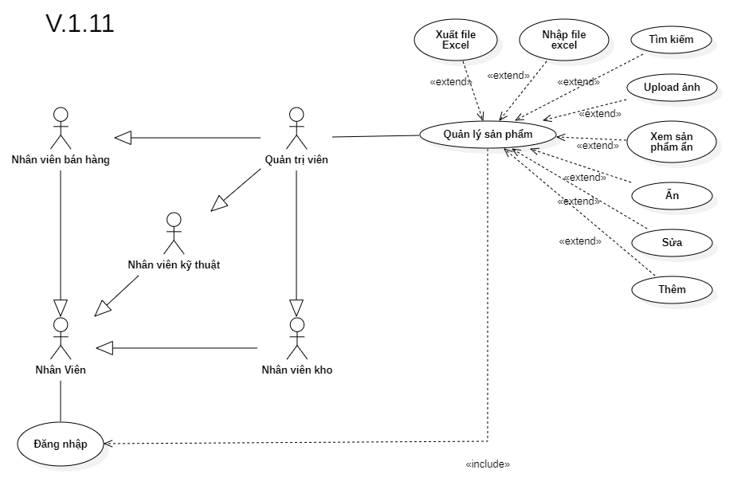

# Phân tích chức năng quản lý sản phẩm

## I. Phân tích use case:
  

#### Link ảnh [Use case quản lý sản phẩm](images/UseCaseProductManagement.png).

### Đặc tả chức năng quản lý sản phẩm:

<table>
  <tbody>
    <tr>
      <td>
        <b>Tên chức năng</b>
      </td>
      <td>Quản lý sản phẩm</td>
    </tr>
    <tr>
      <td>
        <b>Tác nhân</b>
      </td>
      <td>Quản trị viên</td>
    </tr>
    <tr>
      <td>
        <b>Điều kiện trước</b>
      </td>
      <td>Đăng nhập vào hệ thống</td>
    </tr>
    <tr>
      <td>
        <b>Điều kiện sau</b>
      </td>
      <td>
       Khi nhấn nút thoát chức năng.
      </td>
    </tr>
    <tr>
      <td>
        <b>Luồng sự kiện</b>
      </td>
      <td>
        <table>
          <tbody>
            <b>Tạo sản phẩm mới vào hệ thống.</b>
            <tr>
              <td>STT</td>
              <td>Tác nhân</td>
              <td>Hệ thống phản hồi</td>
            </tr>
            <tr>
              <td>1</td>
              <td>Truy cập vào hệ thống chọn chức năng quản lý sản phẩm.</td>
              <td>
                Trả về giao diện chức quản lý sản phẩm cùng với danh sách sản phẩm trong cửa hàng.
              </td>
            </tr>
            <tr>
              <td>2</td>
              <td>Nhấn vào nút thêm mới sản phẩm.</td>
              <td>
                Trả về một giao diện form điền các thông tin về sản phẩm mới vào hệ thống.
              </td>
            </tr>
            <tr>
              <td>3</td>
              <td>Nhấn nút lưu lại thông tin sản phẩm mới.</td>
              <td>
                Hệ thông lưu lại thông tin về sản phẩm mới vào hệ thống.
              </td>
            </tr>
          </tbody>
        </table>
      </td>
    </tr>
    <tr>
      <td>
        <b>Luồng thay thế</b>
      </td>
      <td>
      <table>
          <tbody>
            <b>1. Tìm kiếm thông tin sản phẩm.</b>
            <tr>
              <td>STT</td>
              <td>Tác nhân</td>
              <td>Hệ thống phản hồi</td>
            </tr>
            <tr>
              <td>1</td>
              <td>Truy cập vào hệ thống và vào chức năng quản lý sản phẩm.</td>
              <td>
                Trả về giao diện chức năng quản lý sản phẩm.
              </td>
            </tr>
            <tr>
              <td>2</td>
              <td>Nhập tên hoặc mã sản phẩm cần tìm thông tin.</td>
              <td>
                Trả về danh sách sản phẩm có thông tin trùng khớp.
              </td>
            </tr>
          </tbody>
        </table>
        <table>
          <tbody>
            <b>2. Cập nhật thông tin sản phẩm.</b>
            <tr>
              <td>STT</td>
              <td>Tác nhân</td>
              <td>Hệ thống phản hồi</td>
            </tr>
            <tr>
              <td>1</td>
              <td>Truy cập vào hệ thống và vào chức năng quản lý sản phẩm.</td>
              <td>
                Trả về giao diện chức năng quản lý sản phẩm với danh sách sản phẩm trong cửa hàng.
              </td>
            </tr>
            <tr>
              <td>2</td>
              <td>Chọn sản phẩm cần cập nhật thông tin cần chỉnh sửa.</td>
              <td>
                Trả về thông tin sản phẩm cần chỉnh sửa.
              </td>
            </tr>
            <tr>
              <td>3</td>
              <td>Nhập thông tin cần thay đổi của sản phẩm.</td>
              <td>
                Kiểm tra tính đúng đắn của thông tin nhập vào.
              </td>
            </tr>
            <tr>
              <td>4</td>
              <td>Nhấn nút lưu.</td>
              <td>
                Hệ thống lưu lại thông tin mới cập nhật của sản phẩm.
              </td>
            </tr>
          </tbody>
        </table>
        <table>
          <tbody>
            <b>3. Ẩn sản phẩm khỏi hệ thống.</b>
            <tr>
              <td>STT</td>
              <td>Tác nhân</td>
              <td>Hệ thống phản hồi</td>
            </tr>
            <tr>
              <td>1</td>
              <td>Truy cập vào hệ thống và vào chức năng quản lý sản phẩm.</td>
              <td>
                Trả về giao diện chức năng quản lý sản phẩm với danh sách sản phẩm trong cửa hàng.
              </td>
            </tr>
            <tr>
              <td>2</td>
              <td>Chọn sản phẩm cần ẩn khỏi hệ thống.</td>
              <td>
                Trả về thông tin sản phẩm cần ẩn.
              </td>
            </tr>
            <tr>
              <td>3</td>
              <td>Nhấn nút ẩn.</td>
              <td>
                Hệ thống cập nhật lại thông thuộc tín của sản phẩm là ẩn và sẽ không hiển thị trong lúc tìm sản phẩm trong chức năng bán hàng nữa.
              </td>
            </tr>
          </tbody>
        </table>
        <table>
          <tbody>
            <b>4. Nhập thông tin sản phẩm hàng loạt từ file excel.</b>
            <tr>
              <td>STT</td>
              <td>Tác nhân</td>
              <td>Hệ thống phản hồi</td>
            </tr>
            <tr>
              <td>1</td>
              <td>Truy cập vào hệ thống và vào chức năng quản lý sản phẩm.</td>
              <td>
                Trả về giao diện chức năng quản lý sản phẩm với danh sách sản phẩm trong cửa hàng.
              </td>
            </tr>
            <tr>
              <td>2</td>
              <td>Chọn chức năng nhập thông tin sản phẩm từ file excel.</td>
              <td>
                Trả về giao diện để tải lên file excel và các thông tin có liên quan (nếu có).
              </td>
            </tr>
            <tr>
              <td>3</td>
              <td>Tải lên file excel và nhập các thông tin cần thiết.</td>
              <td>
                Hệ thống kiểm tra tính đúng đắn và hiển thị giao diện một danh sách sản phẩm tạm thời nếu xác nhận lưu vào hệ thống.
              </td>
            </tr>
            <tr>
              <td>4</td>
              <td>Nhấn nút lưu.</td>
              <td>
                Hệ thống lưu lại danh sách sản phẩm vừa được nhập vào từ file excel vào cô sở dữ liệu.
              </td>
            </tr>
          </tbody>
        </table>
        <table>
          <tbody>
            <b>5. Xuất danh sách sản phẩm có trong hệ thống ra file excel.</b>
            <tr>
              <td>STT</td>
              <td>Tác nhân</td>
              <td>Hệ thống phản hồi</td>
            </tr>
            <tr>
              <td>1</td>
              <td>Truy cập vào hệ thống và vào chức năng quản lý sản phẩm.</td>
              <td>
                Trả về giao diện chức năng quản lý sản phẩm với danh sách sản phẩm trong cửa hàng.
              </td>
            </tr>
            <tr>
              <td>2</td>
              <td>Chọn chức năng xuất danh sách sản phẩm ra file excel.</td>
              <td>
                Trả về giao diện xuất danh sách sản phẩm ra file excel và các thông tin có liên quan (nếu có).
              </td>
            </tr>
            <tr>
              <td>3</td>
              <td>Nhấn nút xuất.</td>
              <td>
                Hệ thống trả về file excel danh sách sản phẩm.
              </td>
            </tr>
          </tbody>
        </table>
      </td>
    </tr>
        <tr>
      <td>
        <b>Luồng ngoại lệ</b>
      </td>
      <td>
        <table>
          <tbody>
            <b>Thoát chức năng.</b>
            <tr>
              <td>STT</td>
              <td>Tác nhân</td>
              <td>Hệ thống phản hồi</td>
            </tr>
            <tr>
              <td>1</td>
              <td>Đang ở giao diện chức năng quản lý sản phẩm.</td>
              <td>
                Hệ thông đang lưu các dữ liệu tạm thời để chạy chức năng quản lý sản phẩm.
              </td>
            </tr>
            <tr>
              <td>2</td>
              <td>Nhấn nút thoát.</td>
              <td>
                Hệ thống trả lại giao diện chính và xóa các dữ liệu lưu tạm thời của chức năng quản lý sản phẩm.
              </td>
            </tr>
          </tbody>
        </table>
      </td>
    </tr>
    <tr>
      <td>
        <b>Mô tả</b>
      </td>
      <td>
        Cho phép thêm, ẩn, cập nhật thông tin, nhập xuất từ file excel của sản phẩm bên trong hệ thống.
      </td>
    </tr>
  </tbody>
</table>