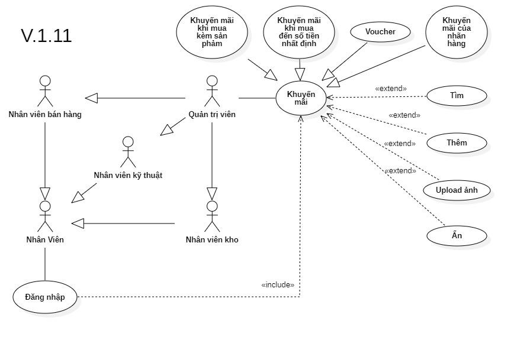

# Phân tích chức năng quản lý khuyến mãi

## I. Phân tích use case:
  

#### Link ảnh [Use case quản lý khuyến mãi](images/UseCasePromotionManager.png).

### Đặc tả chức năng quản lý khuyến mãi:

<table>
  <tbody>
    <tr>
      <td>
        <b>Tên chức năng</b>
      </td>
      <td>Quản lý khuyến mãi</td>
    </tr>
    <tr>
      <td>
        <b>Tác nhân</b>
      </td>
      <td>Quản trị viên</td>
    </tr>
    <tr>
      <td>
        <b>Điều kiện trước</b>
      </td>
      <td>Đăng nhập vào hệ thống</td>
    </tr>
    <tr>
      <td>
        <b>Điều kiện sau</b>
      </td>
      <td>
       Khi nhấn nút thoát chức năng.
      </td>
    </tr>
    <tr>
      <td>
        <b>Luồng sự kiện</b>
      </td>
      <td>
        <table>
          <tbody>
            <b>Tạo khuyến mãi mới.</b>
            <tr>
              <td>STT</td>
              <td>Tác nhân</td>
              <td>Hệ thống phản hồi</td>
            </tr>
            <tr>
              <td>1</td>
              <td>Truy cập vào hệ thống chọn chức năng quản lý khuyến mãi.</td>
              <td>
                Trả về giao diện chức quản lý khuyến mãi.
              </td>
            </tr>
            <tr>
              <td>2</td>
              <td>Nhấn vào nút tạo mới khuyến mãi.</td>
              <td>
                Hệ thống trả về giao diện điện thông tin để tạo mới khuyến mãi gồm mã khuyến mãi, tên, khoảng thời gian áp dụng, giá trị hoặc sản phẩm được tặng, áp dụng cho sản phẩm hoặc mức tiền nào, nọi dung chi tiết khuyến mãi, ảnh.
              </td>
            </tr>
            <tr>
              <td>3</td>
              <td>Người dùng nhấn nút lưu.</td>
              <td>
                Hệ thông trả về một cửa sổ xác hiển thị các thông tin của khuyến mãi mới và xác nhận yêu cầu ngời dùng xác nhận lại lần nửa trước khi tạo.
              </td>
            </tr>
            <tr>
              <td>4</td>
              <td>Người dùng nhấn xác nhận tạo.</td>
              <td>
                Hệ thống lưu khuyến mãi mói xuống hệ thống.
              </td>
            </tr>
          </tbody>
        </table>
      </td>
    </tr>
    <tr>
      <td>
        <b>Luồng thay thế</b>
      </td>
      <td>
        <table>
          <tbody>
            <b>1. Tìm kiếm thông tin khuyến mãi.</b>
            <tr>
              <td>STT</td>
              <td>Tác nhân</td>
              <td>Hệ thống phản hồi</td>
            </tr>
            <tr>
              <td>1</td>
              <td>Truy cập vào hệ thống và vào chức năng quản lý khuyến mãi.</td>
              <td>
                Trả về giao diện chức năng quản lý khuyến mãi.
              </td>
            </tr>
            <tr>
              <td>2</td>
              <td>Nhập mã khuyến mãi hoặc tên khuyến mãi cần tìm thông tin.</td>
              <td>
                Trả về danh sách khuyến mãi có thông tin trùng khớp.
              </td>
            </tr>
          </tbody>
        </table>
        <table>
          <tbody>
            <b>2.Xóa khuyến mãi.</b>
            <tr>
              <td>STT</td>
              <td>Tác nhân</td>
              <td>Hệ thống phản hồi</td>
            </tr>
            <tr>
              <td>1</td>
              <td>Truy cập vào hệ thống chọn chức năng quản lý khuyến mãi.</td>
              <td>
                Trả về giao diện chức quản lý khuyến mãi.
              </td>
            </tr>
            <tr>
              <td>2</td>
              <td>Nhập mã khuyến mãi hoặc tên khuyến mãi cần tìm thông tin.</td>
              <td>
                Trả về danh sách khuyến mãi có thông tin trùng khớp.
              </td>
            </tr>
            <tr>
              <td>3</td>
              <td>Người dùng chọn khuyến mãi cần xóa và nhấn xóa.</td>
              <td>
                Hệ thống trả về cửa sổ xác nhận xóa khuyến mãi.
              </td>
            </tr>
            <tr>
              <td>4</td>
              <td>Người dung xác nhận xóa.</td>
              <td>
                Hệ thống thông tin khuyến mãi ra khỏi hệ thống.
              </td>
            </tr>
          </tbody>
        </table>
      </td>
    </tr>
        <tr>
      <td>
        <b>Luồng ngoại lệ</b>
      </td>
      <td>
        <table>
          <tbody>
            <b>Thoát chức năng.</b>
            <tr>
              <td>STT</td>
              <td>Tác nhân</td>
              <td>Hệ thống phản hồi</td>
            </tr>
            <tr>
              <td>1</td>
              <td>Đang ở giao diện chức năng quản lý khuyến mãi.</td>
              <td>
                Hệ thông đang lưu các dữ liệu tạm thời để chạy chức năng quản lý khuyến mãi.
              </td>
            </tr>
            <tr>
              <td>2</td>
              <td>Nhấn nút thoát.</td>
              <td>
                Hệ thống trả lại giao diện chính và xóa các dữ liệu lưu tạm thời của chức năng quản lý khuyến mãi.
              </td>
            </tr>
          </tbody>
        </table>
      </td>
    </tr>
    <tr>
      <td>
        <b>Mô tả</b>
      </td>
      <td>
        Hổ trợ người dùng tạo, xóa và quản lý các chương trình khuyến mãi dể dàng hơn.
      </td>
    </tr>
  </tbody>
</table>