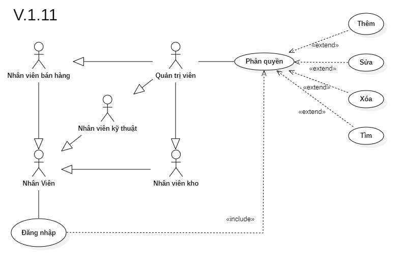

# Phân tích chức năng phân quyền

## I. Phân tích use case:
  

#### Link ảnh [Use case phân quyền](images/UseCaseRole.png).

### Đặc tả chức năng phân quyền:

<table>
  <tbody>
    <tr>
      <td>
        <b>Tên chức năng</b>
      </td>
      <td>Phân quyền</td>
    </tr>
    <tr>
      <td>
        <b>Tác nhân</b>
      </td>
      <td>Quản trị viên</td>
    </tr>
    <tr>
      <td>
        <b>Điều kiện trước</b>
      </td>
      <td>Đăng nhập vào hệ thống</td>
    </tr>
    <tr>
      <td>
        <b>Điều kiện sau</b>
      </td>
      <td>
       Khi nhấn nút thoát chức năng.
      </td>
    </tr>
    <tr>
      <td>
        <b>Luồng sự kiện</b>
      </td>
      <td>
        <table>
          <tbody>
            <b>Tạo dữ liệu phân quyền mới.</b>
            <tr>
              <td>STT</td>
              <td>Tác nhân</td>
              <td>Hệ thống phản hồi</td>
            </tr>
            <tr>
              <td>1</td>
              <td>Truy cập vào hệ thống chọn chức năng phân quyền.</td>
              <td>
                Trả về giao diện chức phân quyền.
              </td>
            </tr>
            <tr>
              <td>2</td>
              <td>Nhấn vào nút tạo phân quyền.</td>
              <td>
                Trả về cửa sổ điền các thông tin cần để tạo phân quyền mới.
              </td>
            </tr>
            <tr>
              <td>3</td>
              <td>Người dùng nhấn nút lưu.</td>
              <td>
                Hệ thống lưu thông tin phân quyền mới vào hệ thống.
              </td>
            </tr>
          </tbody>
        </table>
      </td>
    </tr>
    <tr>
      <td>
        <b>Luồng thay thế</b>
      </td>
      <td>
        <table>
          <tbody>
            <b>1. Tìm kiếm thông tin phân quyền.</b>
            <tr>
              <td>STT</td>
              <td>Tác nhân</td>
              <td>Hệ thống phản hồi</td>
            </tr>
            <tr>
              <td>1</td>
              <td>Truy cập vào hệ thống và vào chức năng phân quyền.</td>
              <td>
                Trả về giao diện chức năng phân quyền.
              </td>
            </tr>
            <tr>
              <td>2</td>
              <td>Nhập mã phân quyền hoặc tên cần tìm thông tin.</td>
              <td>
                Trả về danh sách phân quyền có thông tin trùng khớp.
              </td>
            </tr>
          </tbody>
        </table>
        <table>
          <tbody>
            <b>2 Cập nhật thông tin phân quyền.</b>
            <tr>
              <td>STT</td>
              <td>Tác nhân</td>
              <td>Hệ thống phản hồi</td>
            </tr>
            <tr>
              <td>1</td>
              <td>Truy cập vào hệ thống chọn chức năng phân quyền.</td>
              <td>
                Trả về giao diện chức phân quyền.
              </td>
            </tr>
            <tr>
              <td>2</td>
              <td>Nhập mã phân quyền hoặc tên cần tìm thông tin.</td>
              <td>
                Trả về danh sách phân quyền có thông tin trùng khớp.
              </td>
            </tr>
            <tr>
              <td>3</td>
              <td>Chọn phân quyền cần cập nhật thông tin.</td>
              <td>
                Hệ thống hiển thị thông tin chi tiết của phân quyền cần cập nhật.
              </td>
            </tr>
            <tr>
              <td>4</td>
              <td>Nhập thông tin cần thay đổi của phân quyền.</td>
              <td>
                Hệ thông kiểm tra tính đúng đắn của dữ liệu vừa nhập.
              </td>
            </tr>
            <tr>
              <td>5</td>
              <td>Người dùng nhấn nút lưu.</td>
              <td>
                Hệ thông lưu lại thông tin vừa được thay đổi của phân quyền.
              </td>
            </tr>
          </tbody>
        </table>
        <table>
          <tbody>
            <b>4. Xóa phân quyền.</b>
            <tr>
              <td>STT</td>
              <td>Tác nhân</td>
              <td>Hệ thống phản hồi</td>
            </tr>
            <tr>
              <td>1</td>
              <td>Truy cập vào hệ thống chọn chức năng phân quyền.</td>
              <td>
                Trả về giao diện chức phân quyền.
              </td>
            </tr>
            <tr>
              <td>2</td>
              <td>Nhập mã phân quyền hoặc tên cần tìm thông tin.</td>
              <td>
                Trả về danh sách phân quyền có thông tin trùng khớp.
              </td>
            </tr>
            <tr>
              <td>3</td>
              <td>Chọn phân quyền cần xóa thông tin.</td>
              <td>
                Hệ thống hiển thị thông tin chi tiết của phân quyền cần xóa.
              </td>
            </tr>
            <tr>
              <td>4</td>
              <td>Nhấn nút xóa phân quyền.</td>
              <td>
                Hệ thống hiển thị cửa sổ yêu cầu xác nhận xóa phân quyền.
              </td>
            </tr>
            <tr>
              <td>5</td>
              <td>Người dùng xác nhận xóa.</td>
              <td>
                Hệ thống xóa phân quyền ra khỏi hệ thống.
              </td>
            </tr>
          </tbody>
        </table>
      </td>
    </tr>
        <tr>
      <td>
        <b>Luồng ngoại lệ</b>
      </td>
      <td>
        <table>
          <tbody>
            <b>Thoát chức năng.</b>
            <tr>
              <td>STT</td>
              <td>Tác nhân</td>
              <td>Hệ thống phản hồi</td>
            </tr>
            <tr>
              <td>1</td>
              <td>Đang ở giao diện chức năng phân quyền.</td>
              <td>
                Hệ thông đang lưu các dữ liệu tạm thời để chạy chức năng phân quyền.
              </td>
            </tr>
            <tr>
              <td>2</td>
              <td>Nhấn nút thoát.</td>
              <td>
                Hệ thống trả lại giao diện chính và xóa các dữ liệu lưu tạm thời của chức năng phân quyền.
              </td>
            </tr>
          </tbody>
        </table>
      </td>
    </tr>
    <tr>
      <td>
        <b>Mô tả</b>
      </td>
      <td>
        Hổ trợ người dùng quản lý dữ liệu phân quyền, thêm mới, cập nhật hoặc xóa phân quyền không còn sử dụng.
      </td>
    </tr>
  </tbody>
</table>