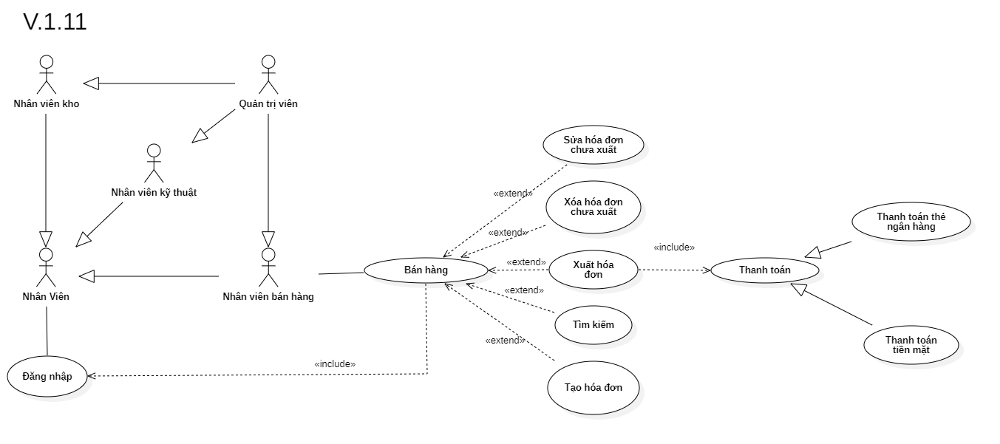

# Phân tích chức năng bán hàng

## I. Phân tích use case:
  

#### Link ảnh [Use case bán hàng](images/UseCaseSale.png).

### Đặc tả chức năng bán hàng:

<table>
  <tbody>
    <tr>
      <td>
        <b>Tên chức năng</b>
      </td>
      <td>Bán hàng</td>
    </tr>
    <tr>
      <td>
        <b>Tác nhân</b>
      </td>
      <td>Nhân viên bán hàng</td>
    </tr>
    <tr>
      <td>
        <b>Điều kiện trước</b>
      </td>
      <td>Đăng nhập vào hệ thống</td>
    </tr>
    <tr>
      <td>
        <b>Điều kiện sau</b>
      </td>
      <td>
      - Khi nhấn nút thoát chức năng.  
      - Khi nhấn xuất hóa đơn bán hàng.
      </td>
    </tr>
    <tr>
      <td>
        <b>Luồng sự kiện</b>
      </td>
      <td>
        <table>
          <tbody>
          <b>Tạo đơn hàng tạm thời cho khách hàng.</b>
            <tr>
              <td>STT</td>
              <td>Tác nhân</td>
              <td>Hệ thống phản hồi</td>
            </tr>
            <tr>
              <td>1</td>
              <td>Truy cập vào hệ thống chọn chức năng bán hàng.</td>
              <td>
                Trả về giao diện chức năng bán hàng với danh sách sản phẩm trong cửa hàng.
              </td>
            </tr>
            <tr>
              <td>2</td>
              <td>Chọn sản phẩm khách hàng cần mua và nhập số lượng.</td>
              <td>
                Lưu lại thông tin sản phẩm và số lượng bên trong giỏ hàng và số tiền cần thanh toán.
              </td>
            </tr>
            <tr>
              <td>3</td>
              <td>Nhấn xuất hóa đơn bán hàng.</td>
              <td>
                Trả về thông tin sản phẩm và số lượng bên trong giỏ hàng và số tiền cần thanh toán.
              </td>
            </tr>
          </tbody>
        </table>
      </td>
    </tr>
    <tr>
      <td>
        <b>Luồng thay thế</b>
      </td>
      <td>
      <table>
          <tbody>
            <b>1. Tìm kiếm sản phẩm.</b>
            <tr>
              <td>STT</td>
              <td>Tác nhân</td>
              <td>Hệ thống phản hồi</td>
            </tr>
            <tr>
              <td>1</td>
              <td>Truy cập vào hệ thống và vào chức năng bán hàng.</td>
              <td>
                Trả về giao diện chức năng bán hàng.
              </td>
            </tr>
            <tr>
              <td>2</td>
              <td>Nhập tên hoặc mã sản phẩm cần tìm.</td>
              <td>
                Trả về danh sách sản phẩm có thông tin trùng khớp.
              </td>
            </tr>
          </tbody>
        </table>
        <table>
          <tbody>
            <b>2. Cập nhật số lượng sản phẩm trong đơn hàng.</b>
            <tr>
              <td>STT</td>
              <td>Tác nhân</td>
              <td>Hệ thống phản hồi</td>
            </tr>
            <tr>
              <td>1</td>
              <td>Truy cập vào hệ thống chọn chức năng bán hàng.</td>
              <td>
                Trả về giao diện chức năng bán hàng với danh sách sản phẩm trong cửa hàng.
              </td>
            </tr>
            <tr>
              <td>2</td>
              <td>Chọn đơn hàng tạm thời cần chỉnh số lượng sản phẩm và chỉnh sửa số lương sản phẩm trong đó.</td>
              <td>
                Trả về thông tin sản phẩm và số lượng bên trong đơn hàng tạm thời và số tiền cần thanh toán.
              </td>
            </tr>
            <tr>
              <td>3</td>
              <td>Nhấn nút lưu.</td>
              <td>
                Hệ thống lưu lại thay đổi của đơn hàng tạm thời.
              </td>
            </tr>
          </tbody>
        </table>
        <table>
          <tbody>
            <b>3. Thanh toán tiền mặt và xuất hóa đơn.</b>
            <tr>
              <td>STT</td>
              <td>Tác nhân</td>
              <td>Hệ thống phản hồi</td>
            </tr>
            <tr>
              <td>1</td>
              <td>Truy cập vào hệ thống và vào chức năng bán hàng.</td>
              <td>
                Trả về giao diện chức năng bán hàng.
              </td>
            </tr>
            <tr>
              <td>2</td>
              <td>Tìm hoặc tạo đơn hàng.</td>
              <td>
                Hệ thống trả về thông tin của đơn hàng.
              </td>
            </tr>
            <tr>
              <td>3</td>
              <td>Nhân viên nhận tiền mặt của khách hàng và nhập vào hệ thống.</td>
              <td>
                Hệ thống mở két đựng tiền và hiển thị số tiền cần thối lại.
              </td>
            </tr>
            <tr>
              <td>4</td>
              <td>Nhân viên nhấn nút xuất hóa đơn.</td>
              <td>
                Hệ thống gửi lệnh đến máy in và in ra hóa đơn.
              </td>
            </tr>
          </tbody>
        </table>
        <table>
          <tbody>
            <b>4. Thanh toán thẻ ngân hàng và xuất hóa đơn.</b>
            <tr>
              <td>STT</td>
              <td>Tác nhân</td>
              <td>Hệ thống phản hồi</td>
            </tr>
            <tr>
              <td>1</td>
              <td>Truy cập vào hệ thống và vào chức năng bán hàng.</td>
              <td>
                Trả về giao diện chức năng bán hàng.
              </td>
            </tr>
            <tr>
              <td>2</td>
              <td>Tìm hoặc tạo đơn hàng.</td>
              <td>
                Hệ thống trả về thông tin của đơn hàng.
              </td>
            </tr>
            <tr>
              <td>3</td>
              <td>Nhân viên nhận thẻ ngân hàng của khách hàng và nhập vào hệ thống.</td>
              <td>
                Hệ thống kết nối với bên ngân hàng và kiểm tra giao dịch từ ngân hàng.
              </td>
            </tr>
            <tr>
              <td>4</td>
              <td>Ngân hàng xác thực giao dịch thành công.</td>
              <td>
                Hệ thống gửi lệnh đến máy in và in ra hóa đơn và in biên lai giao dịch của ngân hàng.
              </td>
            </tr>
          </tbody>
        </table>
        <table>
          <tbody>
            <b>5. Hủy hóa đơn tạm thời.</b>
            <tr>
              <td>STT</td>
              <td>Tác nhân</td>
              <td>Hệ thống phản hồi</td>
            </tr>
            <tr>
              <td>1</td>
              <td>Truy cập vào hệ thống.</td>
              <td>
                Trả về giao diện chức năng bán hàng với danh sách sản phẩm trong cửa hàng.
              </td>
            </tr>
            <tr>
              <td>2</td>
              <td>Chọn đơn hàng tạm thời cần hủy.</td>
              <td>
                Trả về thông tin sản phẩm và số lượng bên trong đơn hàng tạm thời và số tiền cần thanh toán.
              </td>
            </tr>
            <tr>
              <td>3</td>
              <td>Nhấn nút hủy đơn hàng.</td>
              <td>
                Xóa đơn hàng tạm thời.
              </td>
            </tr>
          </tbody>
        </table>
      </td>
    </tr>
    <tr>
      <td>
        <b>Luồng ngoại lệ</b>
      </td>
      <td>
        <table>
          <tbody>
            <b>Thoát chức năng.</b>
            <tr>
              <td>STT</td>
              <td>Tác nhân</td>
              <td>Hệ thống phản hồi</td>
            </tr>
            <tr>
              <td>1</td>
              <td>Đang ở giao diện chức năng bán hàng.</td>
              <td>
                Hệ thông đang lưu các dữ liệu tạm thời để chạy chức năng bán hàng.
              </td>
            </tr>
            <tr>
              <td>2</td>
              <td>Nhấn nút thoát.</td>
              <td>
                Hệ thống trả lại giao diện chính và xóa các dữ liệu lưu tạm thời của chức năng bán hàng.
              </td>
            </tr>
          </tbody>
        </table>
      </td>
    </tr>
    <tr>
      <td>
        <b>Mô tả</b>
      </td>
      <td>
        Cho phép thêm, chỉnh sản phẩm trong giỏ hàng tạm thời và xuất hóa đơn bán hàng khi thanh toán thành công.
      </td>
    </tr>
  </tbody>
</table>