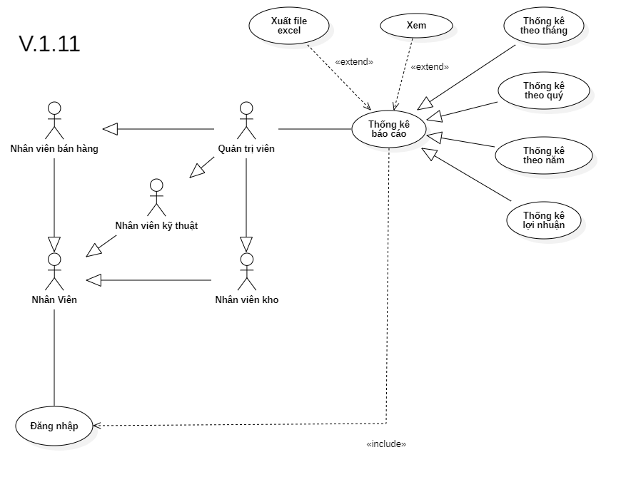

# Phân tích chức năng thông kê báo cáo

## I. Phân tích use case:
  

#### Link ảnh [Use case thông kê báo cáo](images/UseCaseStatisticalReporting.png).

### Đặc tả chức năng thông kê báo cáo:

<table>
  <tbody>
    <tr>
      <td>
        <b>Tên chức năng</b>
      </td>
      <td>Thông kê báo cáo</td>
    </tr>
    <tr>
      <td>
        <b>Tác nhân</b>
      </td>
      <td>Quản trị viên</td>
    </tr>
    <tr>
      <td>
        <b>Điều kiện trước</b>
      </td>
      <td>Đăng nhập vào hệ thống</td>
    </tr>
    <tr>
      <td>
        <b>Điều kiện sau</b>
      </td>
      <td>
       Khi nhấn nút thoát chức năng.
      </td>
    </tr>
    <tr>
      <td>
        <b>Luồng sự kiện</b>
      </td>
      <td>
        <table>
          <tbody>
            <b>Xem báo cáo thống kê.</b>
            <tr>
              <td>STT</td>
              <td>Tác nhân</td>
              <td>Hệ thống phản hồi</td>
            </tr>
            <tr>
              <td>1</td>
              <td>Truy cập vào hệ thống chọn chức năng thông kê báo cáo.</td>
              <td>
                Trả về giao diện chức thông kê báo cáo và các loại báo cáo.
              </td>
            </tr>
            <tr>
              <td>2</td>
              <td>Người dùng chọn loại báo cáo muốn xem.</td>
              <td>
                Trả về cửa sổ điền các thông tin cần để xem thông kê báo cáo.
              </td>
            </tr>
            <tr>
              <td>3</td>
              <td>Người dùng nhấn nút xem.</td>
              <td>
                Hệ thống trả về giao diện thông tin báo cáo thống kê người dùng cần xem.
              </td>
            </tr>
          </tbody>
        </table>
      </td>
    </tr>
    <tr>
      <td>
        <b>Luồng thay thế</b>
      </td>
      <td>
        <table>
          <tbody>
            <b>Xuất file excel thông kê báo cáo.</b>
            <tr>
              <td>STT</td>
              <td>Tác nhân</td>
              <td>Hệ thống phản hồi</td>
            </tr>
            <tr>
              <td>1</td>
              <td>Truy cập vào hệ thống và vào chức năng thông kê báo cáo.</td>
              <td>
                Trả về giao diện chức năng thông kê báo cáo và các loại báo cáo.
              </td>
            </tr>
             <tr>
              <td>2</td>
              <td>Người dùng chọn loại báo cáo muốn xem.</td>
              <td>
                Trả về cửa sổ điền các thông tin cần để xem thông kê báo cáo.
              </td>
            </tr>
            <tr>
              <td>3</td>
              <td>Người dùng nhấn nút xem.</td>
              <td>
                Hệ thống trả về giao diện thông tin báo cáo thống kê người dùng cần xem.
              </td>
            </tr>
            <tr>
              <td>4</td>
              <td>Người dùng nhấn nút xuất file excel.</td>
              <td>
                Hệ thống tạo và xuất ra file excel cho người dùng.
              </td>
            </tr>
          </tbody>
        </table>
      </td>
    </tr>
        <tr>
      <td>
        <b>Luồng ngoại lệ</b>
      </td>
      <td>
        <table>
          <tbody>
            <b>Thoát chức năng.</b>
            <tr>
              <td>STT</td>
              <td>Tác nhân</td>
              <td>Hệ thống phản hồi</td>
            </tr>
            <tr>
              <td>1</td>
              <td>Đang ở giao diện chức năng thông kê báo cáo.</td>
              <td>
                Hệ thông đang lưu các dữ liệu tạm thời để chạy chức năng thông kê báo cáo.
              </td>
            </tr>
            <tr>
              <td>2</td>
              <td>Nhấn nút thoát.</td>
              <td>
                Hệ thống trả lại giao diện chính và xóa các dữ liệu lưu tạm thời của chức năng thông kê báo cáo.
              </td>
            </tr>
          </tbody>
        </table>
      </td>
    </tr>
    <tr>
      <td>
        <b>Mô tả</b>
      </td>
      <td>
        Hổ trợ người dùng các loại báo cáo thống kê và xuất ra file excel.
      </td>
    </tr>
  </tbody>
</table>