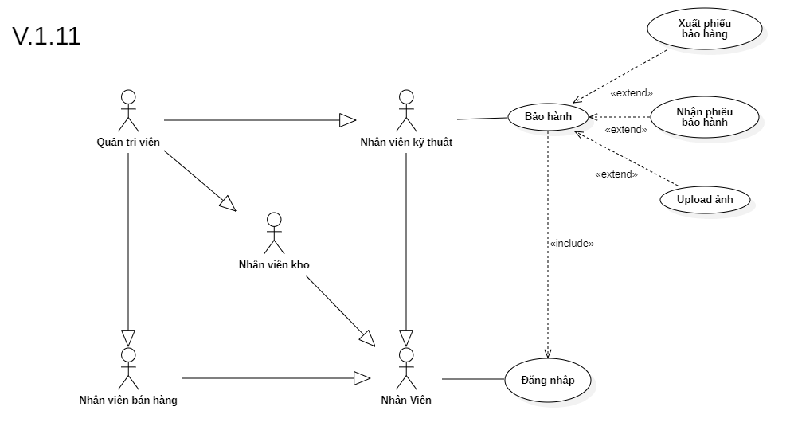

# Phân tích chức năng bảo hành

## I. Phân tích use case:
  

#### Link ảnh [Use case bảo hành](images/UseCaseWarranty.png).

### Đặc tả chức năng bảo hành:

<table>
  <tbody>
    <tr>
      <td>
        <b>Tên chức năng</b>
      </td>
      <td>Bảo hành</td>
    </tr>
    <tr>
      <td>
        <b>Tác nhân</b>
      </td>
      <td>Nhân viên kỹ thuật</td>
    </tr>
    <tr>
      <td>
        <b>Điều kiện trước</b>
      </td>
      <td>Đăng nhập vào hệ thống</td>
    </tr>
    <tr>
      <td>
        <b>Điều kiện sau</b>
      </td>
      <td>
       Khi nhấn nút thoát chức năng.
      </td>
    </tr>
    <tr>
      <td>
        <b>Luồng sự kiện</b>
      </td>
      <td>
        <table>
          <tbody>
            <b>Xuất phiếu bảo hành.</b>
            <tr>
              <td>STT</td>
              <td>Tác nhân</td>
              <td>Hệ thống phản hồi</td>
            </tr>
            <tr>
              <td>1</td>
              <td>Truy cập vào hệ thống chọn chức năng bảo hành.</td>
              <td>
                Trả về giao diện chức bảo hành.
              </td>
            </tr>
            <tr>
              <td>2</td>
              <td>Người dùng chọn xuất phiếu bảo hành.</td>
              <td>
                Hệ thống trả về giao diện nhập thông tin bảo hành sản phẩm cho khách hàng.
              </td>
            </tr>
            <tr>
              <td>3</td>
              <td>Người dùng nhập các thông tin cần thiết để bảo hành.</td>
              <td>
                Hệ thống kiểm tra tính hợp lệ của dữ liệu được nhập vào.
              </td>
            </tr>
            <tr>
              <td>4</td>
              <td>Người dùng nhấn nút xuất phiếu bảo hành và hện khách hàng khi bảo hành hoàn tất.</td>
              <td>
                Hệ thông kêt nối với máy in và in phiếu bảo hành cho khách hàng.
              </td>
            </tr>
          </tbody>
        </table>
      </td>
    </tr>
    <tr>
      <td>
        <b>Luồng thay thế</b>
      </td>
      <td>
        <table>
          <tbody>
            <b>Nhận phiếu bảo hành.</b>
            <tr>
              <td>STT</td>
              <td>Tác nhân</td>
              <td>Hệ thống phản hồi</td>
            </tr>
            <tr>
              <td>1</td>
              <td>Truy cập vào hệ thống và vào chức năng bảo hành.</td>
              <td>
                Trả về giao diện chức năng bảo hành.
              </td>
            </tr>
             <tr>
              <td>2</td>
              <td>Người chọn nhận phiếu bảo hành.</td>
              <td>
                Hệ thống trả về giao diện nhận phiếu bảo hành.
              </td>
            </tr>
            <tr>
              <td>3</td>
              <td>Người dùng nhập thông tin phiếu bảo hành để trả hàng bảo hành và nhận phiếu.</td>
              <td>
                Hệ thống trả về thông tin xuất bảo hàng trong hệ thống.
              </td>
            </tr>
            <tr>
              <td>4</td>
              <td>Người dùng điền các thông tin cần thiết để nhận phiếu và trả hàng bảo hành cho khách hàng.</td>
              <td>
                Hệ thống kiểm tra tính đúng đắng của dữ liệu.
              </td>
            </tr>
            <tr>
              <td>5</td>
              <td>Người dùng nhấn nút nhận hóa đơn.</td>
              <td>
                Hệ thống cập nhật lại thông tin hàng bảo hành đã được nhận bởi khách hàng.
              </td>
            </tr>
          </tbody>
        </table>
      </td>
    </tr>
        <tr>
      <td>
        <b>Luồng ngoại lệ</b>
      </td>
      <td>
        <table>
          <tbody>
            <b>Thoát chức năng.</b>
            <tr>
              <td>STT</td>
              <td>Tác nhân</td>
              <td>Hệ thống phản hồi</td>
            </tr>
            <tr>
              <td>1</td>
              <td>Đang ở giao diện chức năng bảo hành.</td>
              <td>
                Hệ thông đang lưu các dữ liệu tạm thời để chạy chức năng bảo hành.
              </td>
            </tr>
            <tr>
              <td>2</td>
              <td>Nhấn nút thoát.</td>
              <td>
                Hệ thống trả lại giao diện chính và xóa các dữ liệu lưu tạm thời của chức năng bảo hành.
              </td>
            </tr>
          </tbody>
        </table>
      </td>
    </tr>
    <tr>
      <td>
        <b>Mô tả</b>
      </td>
      <td>
        Hỗ trợ cho nhân viên quản lý các phiếu bảo hành của khách hàng và giải quyết các khiếu nạy của khách hàng.
      </td>
    </tr>
  </tbody>
</table>